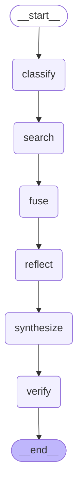

# 🔍 DeepResearch-Lite

> **Traceable Deep Research Agent for AI Engineers** — every claim backed by verifiable sources, NLI-verified.
>
> Built in 1 day with Claude Code · [中文文档](CLAUDE.md)


## Features

1. **Citation Enforcement** — Every claim requires ≥1 evidence citation (Pydantic `min_length=1`). Uncited claims trigger automatic retry.
2. **Independent NLI Verifier** — A separate LLM instance judges each claim against its evidence: `entailed` / `neutral` / `contradicted`. Contradictions are flagged in red.
3. **Multi-Agent Parallel Search** — Web (Tavily) + arXiv subagents run concurrently via `asyncio.gather`, with RRF fusion and deduplication.
4. **Clean Streamlit UI** — Input a question, watch the pipeline run, expand citations to see original source text, and review the Verifier summary at a glance.

## Quick Start

```bash
# 1. Clone and install
git clone https://github.com/merlancozy-star/deepresearch-lite.git
cd deepresearch-lite
pip install -r requirements.txt

# 2. Configure API keys
cp .env.example .env
# Edit .env with your OPENAI_API_KEY (or compatible) and TAVILY_API_KEY

# 3. Run
streamlit run app.py
```

Or via CLI:

```bash
python -m deepresearch.cli "vLLM vs SGLang architecture differences"
```

## Architecture



Source: [`docs/architecture.mmd`](docs/architecture.mmd) — auto-generated by `deepresearch.graph.render_mermaid()`.

## Tested Demo Queries

- `Mamba state space model latest advances` (exploration)
- `vLLM vs SGLang architecture comparison` (comparison)
- `Claude 4 latest release information` (latest)
- `Agent orchestration frameworks comparison` (comparison)
- `RAG evaluation methods state of the art` (exploration)

## Roadmap

**Phase 2 (1-2 weeks):**
- [ ] GitHub + Blog Subagents
- [ ] Verifier sampling strategy (high-confidence 30%, low-confidence 100%)
- [ ] Intent Classifier: add `reproduction` type
- [ ] Next.js frontend (citation popover, streaming visualization tree)

**Phase 3 (3-4 weeks):**
- [ ] MCP Server wrapper (expose 5 tools individually)
- [ ] Docker Compose one-click startup
- [ ] Verifier evaluation script (30-50 human-annotated samples + P/R metrics)
- [ ] Prompt caching optimization (shared system prompts across subagents)

**Phase 4 (Production):**
- [ ] 3-minute product demo video
- [ ] Technical blog post + submit to awesome-mcp-servers / awesome-langchain
- [ ] Long-running task support (>10 min research, checkpoint resume)

## License

MIT © 2025
