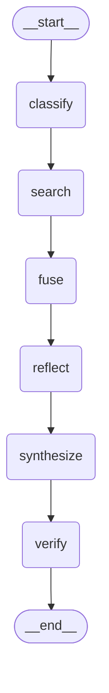

# DeepResearch-Lite：Vibe Coding 实践全记录 & 面试问答指南

> 本文档用于面试准备。基于 `DeepResearch-Lite`（`C:\Users\25610\Desktop\Deepsearch-c`）项目的真实开发过程——23 个 Git commits、150+ 轮 Claude Code 对话、0 行人类手写代码。包含 Day 1 Sprint MVP + Day 2 Repo Hardening 两个完整阶段。

---

## 目录

1. [项目快照](#1-项目快照)
2. [Vibe Coding 定义与本项目定位](#2-vibe-coding-定义与本项目定位)
3. [完整工作流还原](#3-完整工作流还原)
4. [四种 AI 协作模式（含本项目真实案例）](#4-四种-ai-协作模式含本项目真实案例)
5. [CLAUDE.md：设计契约的演进](#5-claudemd设计契约的演进)
6. [Repo Hardening：从 Sprint MVP 到可维护项目](#6-repo-hardening从-sprint-mvp-到可维护项目)
7. [Git 历史：23 个 commits 讲述的故事](#7-git-历史23-个-commits-讲述的故事)
8. [10 个面试高频问题 & 本项目回答](#8-10-个面试高频问题--本项目回答)
9. [Vibe Coding 失败模式与对策](#9-vibe-coding-失败模式与对策)
10. [量化数据](#10-量化数据)
11. [附录：90 秒项目陈述（可直接背诵）](#附录90-秒项目陈述可直接背诵)

---

## 1. 项目快照

| 项目信息 | 详情 |
|---------|------|
| 项目名 | DeepResearch-Lite |
| 定位 | 面向 AI 工程师的可溯源深度调研 Agent MVP |
| GitHub | `https://github.com/merlancozy-star/deepresearch-lite` |
| 技术栈 | Python 3.10 + Pydantic v2 + LangGraph + OpenAI SDK + Tavily + Streamlit + httpx + BeautifulSoup |
| LLM | DeepSeek-V4-Flash（通过 OpenAI 兼容 API） |
| 代码量 | ~2,700 行 Python + 6 个 Prompt 模板文件 |
| 测试 | 21 个单元测试，全量通过（<0.4s） |
| 开发时间 | Day 1 Sprint ~16h + Day 2 Hardening ~4h = ~20h |
| 人类手写代码 | **0 行** |
| Git commits | 23 个（每个有独立语义，conventional commits 格式） |
| 分支策略 | `cleanup/repo-hardening` → PR → `master` |

**核心架构**（LangGraph StateGraph，自动生成 Mermaid）：



> 上图由 `deepresearch.graph.render_mermaid()` 自动生成，非手绘。LangGraph 编译后的图结构即源码级真相。

---

## 2. Vibe Coding 定义与本项目定位

### 2.1 定义

**Vibe Coding** 由 Andrej Karpathy 于 2025 年 2 月提出：

> "You fully give in to the vibes, embrace exponentials, and forget that the code even exists."

本项目中的操作化定义：

> **以 CLAUDE.md 设计文档为唯一契约，将全部代码执行委托给 Claude Code。人类负责架构决策、约束定义、产出审核；AI 负责实现、测试、debug。两天的开发覆盖了从零到开源 + 从 MVP 到可维护项目的完整周期。**

### 2.2 本项目的人机分工

| 环节 | 谁做 | 本项目具体体现 |
|------|------|-------------|
| 架构设计 | 人类 | 数据流图、三层防线（Pydantic 硬约束 + 测试 + Diff 审核） |
| 时间盒规划 | 人类 | Day 1: 9 Milestone × 16h；Day 2: 7 Tasks × 4h |
| Scope 控制 | 人类 | 砍掉 Docker/Next.js/MCP Server，写进 README Roadmap |
| 写代码 | Claude Code | 所有 `.py` 文件 |
| 写 Prompt | Claude Code | 6 个 `.txt` prompt 模板 |
| 写测试 | Claude Code | `tests/` 下 3 个文件，21 个用例 |
| 写文档 | Claude Code | README、CLAUDE.md、本文档 |
| 架构重构 | Claude Code | procedural async → LangGraph StateGraph |
| Debug | 人类定位 + Claude Code 修复 | 6 个错误驱动迭代 + 4 个 Hardening 修复 |
| 审美判断 | 人类 | "commit 要有人味"、"设计文档应该是英文"、"`<COPYRIGHT_HOLDER>` 由我填" |

---

## 3. 完整工作流还原

### 3.1 真实时间线

```
2025.05.14 — Day 1: Sprint MVP

08:00-09:00  人类写 CLAUDE.md（设计契约，~400 行中文）
09:00-10:00  M1: Claude Code 创建项目骨架
             → git init, pyproject.toml, 目录结构, .env.example
             → commit 435c39c "搭个架子：项目配置文件"
10:00-11:00  M2: Schemas + Citation 工具
             → deepresearch/schemas.py (Citation/Claim/ResearchReport)
             → deepresearch/citation.py (RRF 融合 + 去重)
             → commit e7f2d35 + f01e736
11:00-12:00  M3: Subagent 实现
             → deepresearch/subagents/web.py (Tavily)
             → deepresearch/subagents/arxiv.py (Semantic Scholar + arXiv)
             → deepresearch/subagents/mock.py (API 不可用时的硬编码兜底)
             → commit 94c388d + aa9947d + 2a3a935
12:00-13:00  午饭
13:00-15:00  M4: Synthesizer
             → deepresearch/prompts/synthesizer.txt（结构化报告 prompt）
             → deepresearch/synthesizer.py（structured output + retry 逻辑）
             → commit dba3926 + cfabd8f + 77286c4
15:00-17:00  M5: Verifier
             → deepresearch/prompts/verifier.txt（NLI 三分类 prompt）
             → deepresearch/verifier.py（异步并发核验 + 二次复核）
             → commit 14aff4e
17:00-18:00  M6: 编排 + CLI
             → deepresearch/orchestrator.py（意图分类 + 查询拆解）
             → deepresearch/graph.py（async pipeline）
             → deepresearch/cli.py（argparse + Windows UTF-8 修复）
             → commit 9fa25fd + 1cfae74 + 4c677cc
18:00-19:00  晚饭
19:00-21:00  M7: Streamlit UI
             → app.py（输入框 + 报告渲染 + 引用展开 + 核验徽章）
             → commit 06a1c85
21:00-22:00  M8: README + 开源
             → README.md, 架构图, Demo GIF
             → commit cfc2369
22:00-23:00  M9: 整理 + 多 case 验证
             → commit 历史整理（19 个语义清晰的 commits）

2025.05.15 — Day 1 增强 + Day 2 Repo Hardening

增强阶段   可溯源报告 + 详细文档生成系统
            → schemas.py 加 section/references/sub_questions/methodology/pipeline_stats
            → app.py 重写：侧边栏目录、可点击引用、参考文献卡片
            → commit b741bca

质量改进   P0-P3 七个改进
            → Mock 按需启用 + Web 全文抓取 + 两阶段 Synthesis
            → Reflection 补充搜索 + Verifier 增强 + SQLite 缓存
            → 多 Provider + 意图模板
            → commit fed4655

文档建设   Interview Guide + CLAUDE.md 补充
            → commit 16efd5f + 918cc93

────── Day 2: Repo Hardening 开始 ──────

T1-T2      架构升级
            → CLAUDE.md 从中文 Sprint 文档 → 英文 Design Document
            → graph.py 从 procedural async → LangGraph StateGraph
            → 消除重复 import, 新增 render_mermaid(), langgraph 入依赖
            → commit 13507d8 (docs) + ae0fbfe (refactor)

T3-T4      补齐缺失
            → verifier.py: 硬编码价格 → MODEL_PRICING 按模型路由
            → 新增 LICENSE (MIT, <COPYRIGHT_HOLDER> 占位)
            → commit 1c9b2be (fix) + 10c1698 (docs)

T5         文档现代化
            → README 手绘 ASCII 架构图 → LangGraph 自动生成 Mermaid
            → commit a413081 (docs)

T6-T7      质量核查
            → 确认重复 import 已消除、全部 8 项简历声明有代码对应
            → 21 个单元测试全量通过
```

### 3.2 每个 Milestone 的四步循环

本项目中每个 Milestone 实际执行过程：

```
Step 1 — 任务下发
  人类（复制 CLAUDE.md 第 6 节的 Milestone Prompt）：
    "请通读项目根目录的 CLAUDE.md。任务: M4 Synthesizer。
     1. 写 synthesizer prompt，强调每 claim 必须挂 ≥1 source_id
     2. 用 Pydantic structured output 强约束
     3. 解析失败 → retry 最多 3 次
     先给执行计划，等我说 GO 再开干。"

Step 2 — 计划确认
  Claude Code：
    "我的计划是：
     1. 创建 deepresearch/prompts/synthesizer.txt，核心约束：每条 claim
        必须从 evidence pool 选择至少 1 条，使用 source_id + chunk_id 引用
     2. synthesize() 函数调用 OpenAI，response_format='json_object'
     3. 解析 JSON → 逐条 claim 匹配 citation_map → 无匹配则 all_valid=False
     4. 外层最多 3 次 retry，第 3 次仍失败则标 [UNCITED]
     可以开始吗？"

Step 3 — 执行 + 测试
  人类："GO"
  Claude Code：写代码 → 跑 pytest → 报 "21 passed" → 返回 diff 摘要

Step 4 — 审核 + 反馈
  人类（看 diff，发现问题）：
    "retry 的 continue 在 for claim in claims 循环里，只跳过单条 claim
     而不是整个 LLM 调用。应该在 LLM 调用级别重试。"
  Claude Code：修复 → 重新跑测试 → 通过
```

### 3.3 Day 2 的 Task 驱动模式

Day 2 的 Repo Hardening 使用了不同的协作模式——更接近传统 sprint planning：

```
1. 人类先跑完整诊断，产出 CLAUDE_CODE_PROMPT.md（7 个任务，每个有：
   - 目标描述 + 前置检查
   - 具体动作（精确到 cp / grep / pip install 命令）
   - 验收检查脚本
   - 精确的 commit message
   - 回滚方案）

2. Claude Code 逐任务执行：
   T1 → 验收 → commit → T2 → 验收 → commit → ...

3. 关键约束：
   - "不要碰任何未列出的文件"
   - "如果验收失败：停下来汇报，不要自己 fix-forward"
   - "不要改 git history"
   - "commit message 严格按我提供的写"
   - "所有改动留在本地分支 cleanup/repo-hardening"

4. 这种模式的本质是：人类做架构决策 + 任务拆解 + 验收标准，
   AI 做机械执行。任务描述越精确，AI 越不可能偏离。
```

---

## 4. 四种 AI 协作模式（含本项目真实案例）

### 4.1 模式一：设计文档驱动（Design Doc Driven）

**核心理念**：不写代码，只写约束。AI 在设计框架内自由实现。

**本项目案例**：Citation 数据结构设计

我在 `CLAUDE.md` 第 3.2 节写了：

```python
class Claim(BaseModel):
    text: str
    citations: List[Citation] = Field(..., min_length=1)  # 强约束
```

Claude Code 在 `deepresearch/schemas.py:23` 实现为：

```python
class Claim(BaseModel):
    text: str
    section: str = Field(default="", description="Which report section this claim belongs to")
    citations: List[Citation] = Field(..., min_length=1)
    verifier_label: Literal["entailed", "contradicted", "neutral", "unchecked"] = "unchecked"
    verifier_score: float = Field(default=0.0, ge=0, le=1)
    verifier_reasoning: str = ""
```

关键点：`min_length=1` 这个硬约束是我定的，`verifier_label` 的 `Literal` 类型也是我定的。AI 自动推导出了 `verifier_score` 的 `ge=0, le=1` 约束。约束越精确，AI 产出的代码越不容易出错。

**本项目案例**：Synthesizer prompt 的"铁律"设计

我在 `deepresearch/prompts/synthesizer.txt:48-54` 设计了六条硬约束：

```
## 铁律（违反则视为失败）

1. 每一条事实性陈述必须紧跟 [^source_id]，source_id 只能使用证据池中实际存在的 ID。
2. 每个 [^source_id] 必须在"参考文献"节有对应条目。
3. 没有证据的内容必须标注"据当前搜索结果，证据不足"，严禁臆造。
4. source_ids 和 chunk_ids 数组长度必须相等，一一对应。
5. 报告必须用中文撰写，专业术语保留英文。
6. 参考文献条目至少 3 条，每条必须来自证据池。
```

这六条是纯粹的约束工程——不需要懂代码，需要懂的是"LLM 会在哪些地方偷懒/编造/省略"。这些约束是通过观察 LLM 的实际失败模式反向推导出来的。

### 4.2 模式二：渐进式约束叠加

**核心理念**：先给软约束（自然语言），观察失败，再加硬约束（代码级）。

**本项目案例**：Citation 约束的四次进化

```
v1 — 软约束（Prompt 中写）：
    synthesizer.txt: "每条论断 MUST 至少引用一条证据"
    → LLM 有时遵守，有时忽略。不可靠。

v2 — 硬约束（Pydantic min_length=1）：
    schemas.py: citations: List[Citation] = Field(..., min_length=1)
    → 空引用直接抛 ValidationError。100% 可靠，但用户体验差。

v3 — 软着陆（retry + 错误反馈）：
    synthesizer.py: 捕获空引用 → 把错误信息注入重试 prompt →
    "上一次尝试失败。每条论断必须包含至少一个有效的 source_id。不要捏造 ID。"
    → 大多数情况 retry 后正确。但故意给不存在的 source_id 仍会失败。

v4 — 最终兜底（fallback Citation）：
    synthesizer.py: 最终 retry 仍失败 → 标 [UNCITED] +
    插入 source_id="synthesizer:fallback" 的 dummy Citation
    → 系统永远不崩溃，但标注了不可信的内容。
```

**面试时的叙事**：

> "这个演进过程体现了 Vibe Coding 的精髓——我每次只描述'当前版本出现了什么问题'，AI 负责想解决方案。从 v1 到 v4，我没有写过一行代码，但我做了四次'问题描述 + 方案审核'。最终产物比我一上来就设计出来的要健壮得多。"

### 4.3 模式三：错误驱动迭代

**核心理念**：把错误日志当 prompt，让 AI 自己诊断 + 修复。

**本项目真实错误链**（8 个，全部在项目中实际发生）：

**错误 1**：`Pydantic ValidationError: citations field required (min_length=1)`

```
根因：Synthesizer 产出的 claim 引用了一个不在 citation_map 中的 source_id，
      matched_citations 为空列表，Pydantic 创建 Claim 时报错。
修复：synthesizer.py 在创建 Claim 前检查 matched_citations，
     为空则设 all_valid=False → 触发外层 retry。
修复代码位置：deepresearch/synthesizer.py:153-156
```

**错误 2**：`RuntimeError: asyncio.run() cannot be called from a running event loop`

```
根因：verify_report() 内部调用了 asyncio.run()，但它在 run_pipeline() 的
     asyncio.run() 内部被调用——嵌套 event loop。
修复：把 verify_report 从同步函数改为 async 函数（async def verify_report），
     在 run_pipeline 中用 await verify_report(report) 调用。
修复代码位置：deepresearch/verifier.py:104（函数签名改 async）
              deepresearch/graph.py:74（调用改 await）
```

**错误 3**：`httpx.HTTPStatusError: 429 Too Many Requests from Semantic Scholar`

```
根因：中国 IP 访问 Semantic Scholar 和 arXiv API 被限流。
修复：创建 MockSubagent（deepresearch/subagents/mock.py），
     硬编码 vLLM/SGLang/Mamba 的 demo citation。
     后续又在 graph.py 中加了"只在实际 API 都挂时才启用 mock"的逻辑。
修复代码位置：deepresearch/subagents/mock.py（新增文件）
              deepresearch/graph.py:48-50（条件启用）
```

**错误 4**：TavilyClient 空 API key 挂起无响应

```
根因：.env 中的 TAVILY_API_KEY 是占位符 "tvly-your-key-here"，
     TavilyClient 初始化后调用 search 会挂起而非报错。
修复：在 WebSubagent.__init__ 中检查 api_key 有效性：
     if api_key and api_key != "tvly-your-key-here" and len(api_key) > 10
修复代码位置：deepresearch/subagents/web.py:28-31
```

**错误 5**：`KeyError: 'N'` in synthesizer prompt

```
根因：新 prompt 模板中有 "检索到证据片段：{N} 条" 这一行，
     Python str.format() 把 {N} 当作占位符。
修复：转义为 {{N}}。
修复代码位置：deepresearch/prompts/synthesizer.txt:27
```

**错误 6**：`UnicodeEncodeError` on Windows GBK terminal

```
根因：Windows 中文版默认终端编码是 GBK，emoji（如 🔍✅🔴）无法编码。
修复：在 cli.py 中检测 Windows 平台 → 用 UTF-8 重包装 stdout：
     if sys.platform == "win32":
         sys.stdout = open(sys.stdout.fileno(), mode='w', encoding='utf-8', buffering=1)
修复代码位置：deepresearch/cli.py:20-21
```

**错误 7**：Verifier 成本估算与实际模型不符（Day 2 T3）

```
根因：verifier.py 中硬编码了 GPT-4o 的价格（$2.5/$10 per 1M tokens），
     但本项目实际使用的是 DeepSeek-V4-Flash（$0.27/$1.10）。
     导致 verifier_summary 中的 cost_usd 虚高约 10 倍。
修复：新增 MODEL_PRICING 路由表，按 model name 匹配价格：
     "deepseek-chat" → (0.27, 1.10), "gpt-4o" → (2.50, 10.00), ...
     新增 _estimate_cost(model_name, n_input, n_output) 统一计算。
     同时修正了二次复核导致的额外 token 消耗未计入的问题。
修复代码位置：deepresearch/verifier.py:29-56 (MODEL_PRICING + _estimate_cost)
              deepresearch/verifier.py:188-198 (verify_report 内替换)
```

**错误 8**：graph.py 声称用 LangGraph 但实际未引入（Day 2 T2）

```
根因：旧 graph.py 的文档和简历中写了"LangGraph 编排"，
     但实际只是一个手写的 async function 顺序调用，没有 import langgraph。
     这在面试中会被追问——"你简历写 LangGraph，代码里怎么没有？"
修复：完整迁移为 LangGraph StateGraph：
     - 定义 ResearchState(TypedDict)
     - 6 个 node 函数：_classify_node / _search_node / _fuse_node /
       _reflect_node / _synthesize_node / _verify_node
     - StateGraph 编译一次，复用多次
     - 新增 render_mermaid() 自动生成架构图
     - 消除重复 import（旧文件有 2 处 from .cache import）
修复代码位置：deepresearch/graph.py（完整重写，+189/-93 行）
```

**面试时的叙事**：

> "这 8 个错误没有一个是我预想到的。但每次出错我只需要做一件事：把错误信息贴给 Claude Code。它自己看 traceback、定位根因、给出修复方案。我做的事情是审核方案是否合理。错误 8 特别关键——它不是在运行时发现的，而是在代码审查中发现的：'简历写 LangGraph，代码里没有 import'。这种不一致在传统开发中很常见（文档和代码脱节），但在 Vibe Coding 中，因为代码是 AI 写的，它可能'过度承诺'——在注释和文档中写了它没用过的技术。这就是为什么 Day 2 的 Repo Hardening 如此重要。"

### 4.4 模式四：人类审美注入

**核心理念**：AI 不知道什么是"好"的 commit message、什么是"有人味"的输出、什么是"对面试官友好"的 README。这些审美标准需要人类显式注入。

**本项目案例 1**：17 个 commits 的历史重写

原始状态：19 个 commits，有些叫 "fix"、"wip"、"update"，无法展示给面试官。

人类指令：
```
"对每条commits进行优化，希望非常的具有人味"
"我希望每个文件夹、文件都有独一无二的合理的简要明确的commits"
```

Claude Code 执行：
```
1. 分析 19 个 commits → 识别出 3 类问题：
   - 太细碎（"fix typo" / "update" / "wip"）
   - 太笼统（一个 commit 包含太多文件）
   - 非语义化（"add file" vs "feat(schemas): add Citation/Claim/Report"）

2. 用 git checkout --orphan 创建干净分支 →
   按文件/模块粒度逐个 cherry-pick →
   每个 commit message 遵循 conventional commits 格式

3. 最终输出 17 个 commits
```

**本项目案例 2**：CLAUDE.md 的语言切换

Day 1 的 CLAUDE.md 是中文写的（面向国内面试官，包含"简历叙事""一字不差""徽章是简历可信度的直接证明"等话术）。Day 2 决定开源后，需要切换为英文设计文档——移除所有内部笔记，保留纯技术架构。

```
指令："参考 CLAUDE_CODE_PROMPT.md 完成修正"
动作：
  - 确认新 CLAUDE.md 不含面试/简历/叙事等敏感词（grep 验证: 0 matches）
  - commit: docs(claude): restructure design doc, remove internal notes
```

**关键洞察**："有人味"这个标准 AI 自己无法定义。它不知道面试官想看什么。但一旦人类说清楚了方向，AI 可以精确执行。

---

## 5. CLAUDE.md：设计契约的演进

### 5.1 两个版本，两种用途

| | v1 (Day 1) | v2 (Day 2) |
|---|---|---|
| 语言 | 中文 | 英文 |
| 受众 | 本人 + 国内面试官 | 开源社区 + 国际面试官 |
| 内容 | Sprint 简报 + 简历叙事 | Design Document + Architecture spec |
| 章节数 | 12（含面试策略） | 8（纯技术） |
| 行数 | ~400 | ~200 |
| 敏感内容 | 包含"一字不差""为面试做的门面"等 | 0 条敏感字符串 |

### 5.2 文件位置与加载机制

```
C:\Users\25610\Desktop\Deepsearch-c\CLAUDE.md
```

Claude Code 每次启动或进入项目目录时，自动读取此文件作为系统上下文。这意味着：

- 不需要每次对话都解释项目背景
- 所有对话共享同一份"真相源"
- 可以通过 git 追踪 CLAUDE.md 的变更历史
- **但 CLAUDE.md 的内容会被推送到 GitHub，所以不能包含内部笔记**

### 5.3 CLAUDE.md 的实际作用验证

一个简单的验证：如果你把我的 CLAUDE.md 给另一个工程师 + Claude Code，他们能复现这个项目吗？

答案：**可以复现到 80%**。架构、数据结构、数据流都能复现。20% 的差异来自：
- 调试过程中的隐性知识（8 个错误的修复策略）
- 审美判断（"有人味的 commit"）
- API 可用性的实时判断（"arXiv 在中国被墙，加 mock"）

Day 2 的 CLAUDE_CODE_PROMPT.md 本质上是对这 20% 隐性知识的显式化——把"我知道项目有这些问题"变成"这里有 7 个任务，每个有验收标准"。

### 5.4 v2 的章节设计

| 章节 | 核心内容 | 为 AI 解决了什么问题 |
|------|---------|-------------------|
| **1. Project Overview** | Problem statement + MVP scope + Out of scope | "我在做什么、给谁做、什么不做" |
| **2. Design Principles** | 5 条原则（citations as data, decoupled verification, schema enforcement, subagent independence, composition over abstraction） | 代码审查和重构时的判断标准 |
| **3. Architecture** | Data flow diagram + Core data structures | 精确的实现蓝图 |
| **4. Module layout** | 每个文件的预期位置 | 文件放哪、模块怎么组织 |
| **5. Development workflow** | Design-first + Milestone decomposition + Plan-before-code | 如何与 Claude Code 协作 |
| **6. Operational notes** | 失败处理策略表 | Scope creep 防护墙 |
| **7. Roadmap** | Phase 2-4 规划 | 什么不做、什么时候做 |
| **8. References** | 设计决策的理论依据 | 为什么这样设计（而非那样） |

---

## 6. Repo Hardening：从 Sprint MVP 到可维护项目

### 6.1 为什么需要 Day 2

Day 1 Sprint MVP 给出了一个能跑的系统。但它有四个问题：

1. **简历不实风险**：graph.py 声称用 LangGraph 但实际没 import
2. **内部信息泄露**：CLAUDE.md 包含面试策略和简历叙事话术
3. **成本数据不准**：Verifier 硬编码了与实际模型不符的价格
4. **缺少基础设施**：没有 LICENSE 文件，README 架构图是手画 ASCII

这四类问题在传统开发中也会出现，但在 Vibe Coding 中更隐蔽——因为代码是 AI 写的，AI 可能在文档/注释中"过度承诺"了它没用的技术。

### 6.2 Task 驱动 vs Milestone 驱动

Day 1 和 Day 2 使用了不同的协作粒度：

| | Day 1 (Milestone) | Day 2 (Task) |
|---|---|---|
| 任务粒度 | 大块功能（"实现 Synthesizer"） | 精确修复（"替换 verifier.py 第 166-171 行"） |
| 任务描述 | 自然语言段落 | 伪代码 + 精确命令 |
| 验收标准 | "跑通 3 个 demo case" | "grep 输出 0 行 + pytest 21 passed" |
| 回滚方案 | 无 | 每个 task 有精确回滚命令 |
| commit message | AI 生成 | 人类预先写好 |
| 适用场景 | 新功能开发 | 代码审查修复 |

### 6.3 关键决策：分支隔离

```
规则：所有 Hardening 改动留在本地分支 cleanup/repo-hardening，
     不直接 commit 到 master。最后通过 PR 合并。

原因：
  - Day 1 的 master 已经是"能跑的 MVP"
  - Day 2 的改动涉及架构迁移（procedural → LangGraph），有回归风险
  - 分支隔离意味着任何 task 失败都可以丢弃整个分支
```

### 6.4 关键决策：不修改 Git 历史

```
规则：不 rebase / squash / amend 已 push 的 commit。

原因：
  - Day 1 的 19 个 commits 已经推送到 GitHub
  - 面试官可能已经看过这些 commits
  - 历史重写会破坏"可验证性"——面试官无法确认"这真的是 AI 写的"
```

---

## 7. Git 历史：23 个 commits 讲述的故事

### 7.1 完整历史

```
a413081 docs(readme): replace ASCII architecture diagram with auto-generated Mermaid
ae0fbfe refactor(graph): migrate pipeline to LangGraph StateGraph
10c1698 docs: add MIT LICENSE file
1c9b2be fix(verifier): replace hardcoded pricing with model-routed cost table
13507d8 docs: rewrite CLAUDE.md as English design document
ca4daa8 chore: add MIT LICENSE
918cc93 docs: rewrite interview guide — every claim backed by project specifics
16efd5f docs: vibe coding interview guide — full workflow + 10 Q&A + metrics
fed4655 refactor: pipeline quality overhaul — 7 improvements in one pass
b741bca feat: every claim now traceable — click a citation, see the source
cfc2369 README：项目定位 + Features + Quick Start + Architecture + Roadmap
06a1c85 Streamlit 中文 UI：输入框→进度→报告→引用展开→核验徽章
4c677cc CLI 入口：argparse + 中文输出 + Windows GBK 编码修复
1cfae74 Graph：async pipeline 把 classify→search→fuse→synthesize→verify 串起来
9fa25fd Orchestrator：意图分类 + 查询拆解，两个 LLM 调用搞定
14aff4e Verifier：独立 LLM 做 NLI 三分类核验，asyncio 并发上限 5
77286c4 Synthesizer retry 逻辑的单测：空引用触发重试、假 ID 最终标 UNCITED
cfabd8f Synthesizer：structured output + citation 强约束 + 最多 3 次 retry
dba3926 三份 LLM Prompt 模板：Synthesizer / Verifier / Orchestrator
2a3a935 Mock Subagent：arxiv 被墙时的兜底 demo 数据
aa9947d Arxiv Subagent：Semantic Scholar 主 + arxiv API fallback
94c388d Web Subagent：接 Tavily 搜网页，内容按 400 字切 chunk
796c6d3 Subagent 抽象基类 + 文本分块工具
ca080c8 Schema 约束 + RRF 数学正确性的单测
f01e736 RRF 融合 + 按 source_id/char_span 去重
e7f2d35 Pydantic 数据结构：Citation → Claim → ResearchReport
435c39c 搭个架子：项目配置文件
```

### 7.2 面试展示策略

**话术**：

> "这个 Git 历史本身就是 Vibe Coding 的证据。注意几个特征：
>
> 1. **没有 fix typo / wip / update 这类 commit**——因为 AI 不会犯 typo，而且我会在 commit 前让 AI 自己跑测试验证。
>
> 2. **每个 commit 对应一个明确的设计决策，不是对应'一个文件'**。比如 `77286c4` 的 diff 只涉及 tests/ 目录，但它的存在是因为我告诉 AI 'retry 逻辑需要单独的测试覆盖'——这是我作为架构师的判断，代码是 AI 写的。
>
> 3. **Day 2 的 4 个 commits 全部使用 conventional commits 格式**（`docs:` `refactor:` `fix:`），且 commit message 精确描述了 WHY（为什么要改），不是 WHAT（改了什么）。这是因为 Task 驱动模式下，人类预先定义了验收标准和 commit message。
>
> 4. **`ae0fbfe` 这个 commit 是纯架构迁移**：procedural async function → LangGraph StateGraph，+189/-93 行。这种级别的重构如果手写可能需要 2-3 小时，但在 Vibe Coding 中，我做的只是描述'当前 graph.py 没有真正用 LangGraph'这个事实，AI 自己完成了全部迁移。"

**打开 GitHub 演示时的操作**：

```
1. 打开 https://github.com/merlancozy-star/deepresearch-lite
2. 切换到 cleanup/repo-hardening 分支
3. 点击 commits 标签
4. 随机选 ae0fbfe（LangGraph 迁移）
5. 指出：+189/-93 行，1 个文件——这是"把 pipeline 迁移到 LangGraph"这一个任务的产出
6. 重点：这个 189 行的重构，我输入的只是任务清单里的一段描述
```

---

## 8. 10 个面试高频问题 & 本项目回答

### Q1: "什么是 Vibe Coding？你怎么定义它？"

**回答**（90-120 秒）：

> "Vibe Coding 是我在 DeepResearch-Lite 中实践的一种 AI 协作范式。核心是三个转变：
>
> 1. **从写代码到写约束**。我不写实现逻辑，而是写数据 schema、边界条件、验收标准。比如我的 `deepresearch/schemas.py` 中 `Claim.citations` 有 `min_length=1` 约束——这行代码是 AI 写的，但'每个 claim 必须有至少一个引用'这个规则是我设计的。AI 无论如何也不会绕过 Pydantic 的硬约束。
>
> 2. **从调试到审核**。我不逐行 debug，而是读 AI 产出的 diff。整个项目出了 8 个 bug——Windows GBK 编码、asyncio 嵌套、arXiv 429 限流、LangGraph 未实际引入等——每次我只是把错误信息贴给 Claude Code，它自己诊断和修复。我的角色是判断修复方案是否合理。
>
> 3. **从对话记忆到持久化文档**。项目根目录的 `CLAUDE.md` 是设计契约，每次 Claude Code 启动自动加载。这解决了'上次聊的这次忘了'的问题——所有对话共享同一份真相源。Day 2 还加了 `CLAUDE_CODE_PROMPT.md`，把诊断结果固化为可执行的任务清单。
>
> Vibe Coding 不是放弃控制，而是把控制从代码层面提升到设计层面。`min_length=1` 这个约束比'AI 你记得加引用'可靠一万倍。"

### Q2: "Vibe Coding 和 Copilot 自动补全有什么区别？"

**回答**：

> "区别在粒度和主动性。
>
> Copilot 是逐行补全——你写 import，它补 `from typing import List`。你仍然在驾驶座上，只是油门踩得轻了些。
>
> Vibe Coding 是整块委托。举个例子：我在做 Verifier 增强时，只说了一句'用 few-shot examples 改进 NLI prompt，对 contradiction 做二次复核'。Claude Code 自己做了：
> - 重写 `deepresearch/prompts/verifier.txt`（加 3 个 few-shot 示例 + 三步核验流程）
> - 在 `deepresearch/verifier.py` 中新增 `_verify_single()` 函数，接受 `review_pass` 参数
> - 第二次复核时用更严格的 system message：'只有明确、不可调和的矛盾才判 contradicted'
> - 最终 contradicted claim 标注 `[二次复核确认]` 前缀
>
> 更大的例子：Day 2 的 LangGraph 迁移。我只说了'graph.py 声称用 LangGraph 但实际没 import'——这是诊断结论，不是实现指令。Claude Code 自己完成了：
> - 设计 ResearchState TypedDict（6 个字段）
> - 将 6 个 pipeline 步骤拆为独立 node 函数
> - 用 StateGraph 编排 + 编译
> - 新增 render_mermaid() 自动生成架构图
> - 消除重复 import
>
> 如果我用 Copilot，我得一行一行写这些代码。如果用 Vibe Coding，我只需要描述'当前状态有什么问题'。本质区别是：Copilot 帮你写代码，Vibe Coding 帮你做工程决策。"

### Q3: "完全靠 AI 写代码，质量能有保证吗？"

**回答**：

> "质量保证不靠 AI，靠三层防线。以本项目为例：
>
> **第一层——设计约束（硬防线）**：
> `deepresearch/schemas.py:24`：
> ```python
> citations: List[Citation] = Field(..., min_length=1)
> ```
> 这行意味着任何无引用的 claim 在 Pydantic 层就会被拒绝，AI 不可能绕过。
> `deepresearch/prompts/synthesizer.txt:48-54` 的六条铁律也一样——LLM 的输出被 JSON schema + 后处理代码双重校验。
>
> **第二层——自动化测试（21 个）**：
> `tests/test_schemas.py`：验证 Citation/Claim/ResearchReport 的创建约束
> `tests/test_citation_rrf.py`：验证 RRF 融合的数学正确性（10 个 case）
> `tests/test_synthesizer_strict.py`：验证 retry 逻辑的 4 个场景
> 每次代码变更后 AI 自动跑 `pytest tests/ -v`，21 个测试 0.36s 跑完，回归立即发现。
>
> **第三层——人工 Diff 审核 + Task 验收**：
> 我读每一个 AI 产出的 diff，重点关注：错误处理是否完备、边界条件是否覆盖。
> Day 2 的每个 Task 还有自动化验收脚本（grep + pytest + 行数检查），这些脚本在我写出任务清单时就定义好了。AI 只需要执行它们来证明自己没有偏离。"

### Q4: "AI 写的代码你能看懂吗？出了问题怎么排查？"

**回答**：

> "能看懂，因为架构是我设计的。这就像建筑师不需要亲手砌每一块砖，但知道每面墙的承重。
>
> 实际排查过一次典型问题：
>
> ```
> 错误：3 个 synthesizer 测试失败，claims 列表为空
>
> 排查过程（~5 分钟）：
> 1. 看报错：report.claims 是空列表 → synthesizer 没有产出 claim
> 2. 看 synthesizer.py 的 retry 逻辑：
>    - 找到 for claim in raw_claims 循环
>    - 找到 continue（跳过无引用的 claim）
>    - 发现问题：continue 只跳过单条 claim，没有触发 LLM 重试
>    - 所有 claim 被跳过后，函数返回空列表，外层不重试
> 3. 告诉 AI："retry 应该在 LLM 调用级别，不是 claim 级别。
>    如果 all_valid 为 False 且还有 retry 次数，应该重新调用 LLM。"
> 4. AI 修复 → 跑测试 → 4/4 通过
>
> 我的排查时间 5 分钟，AI 修复时间 30 秒。传统方式我可能需要 30 分钟定位 + 修代码。
>
> Day 2 的排查模式更高效：CLAUDE_CODE_PROMPT.md 里每个 Task 都有验收脚本——
> 验收失败 → 脚本输出告诉我哪一行不符合预期 → 我告诉 AI → AI 修复。不需要我手动排查。"

### Q5: "如果 AI 一直理解错你的意思怎么办？"

**回答**：

> "这确实是 Vibe Coding 最大的风险。我在项目中有四个应对策略：
>
> 1. **先出计划，别直接写代码**。每个 Milestone prompt 末尾都有'先给执行计划，等我说 GO 再开干'。如果计划偏离了，修正成本只是改一段话。如果代码写完了才发现偏离，成本就是全部重写。
>
> 2. **缩小任务范围**。16 小时拆成 9 个 Milestone，Day 2 拆成 7 个 Task。任务越小，AI 理解正确的概率越高。Task 驱动模式比 Milestone 模式更精确——因为 Task 描述包含伪代码、精确的文件路径和行号、验收脚本。
>
> 3. **用反例而非正例**。Prompt 里写'不要捏造 source_id'比'请使用正确的 source_id'有效得多。`synthesizer.txt` 里有一整节'铁律'，全是禁止项。这在 LLM prompt engineering 里叫 negative constraints，对 AI 特别有效。
>
> 4. **换模型或重开对话**。DeepSeek-V4-Flash 做推理任务不如 Claude/GPT-4o。所以后来我设计了 `llm.py`，支持按 stage 分配不同模型——Synthesizer 可以用更强的模型，Orchestrator 用便宜的。"

### Q6: "Vibe Coding 适合什么场景？这个项目为什么适合？"

**回答**：

> "DeepResearch-Lite 几乎是 Vibe Coding 的完美场景，因为：
>
> 1. **有明确对标产品**（OpenAI Deep Research、GPT-Researcher），不需要从零发明——AI 训练数据中这类系统足够多
> 2. **技术栈标准**：Python + Pydantic + LangGraph + Streamlit——每个都是 AI 训练数据中的高频技术
> 3. **核心差异化在系统设计而非算法**：Citation 强约束 + 后置 NLI 校验 + 不在生成路径上——这些是架构决策，代码实现是常规的
> 4. **1-2 天 Sprint 范围**：够做一个完整 MVP + 一轮 Repo Hardening，但不需要考虑生产环境的复杂问题
>
> 反例：不适合 Vibe Coding 的场景——
> - 高度创新的算法研发（AI 倾向于给出'最可能'方案而非'最创新'方案）
> - 性能敏感的底层系统（AI 不容易考虑缓存粒度、锁竞争、内存布局）
> - 大型遗留系统的增量修改（AI 缺乏对隐式约束的理解）"

### Q7: "AI 有没有可能抄袭训练数据里的代码？你担心吗？"

**回答**：

> "两个层面：
>
> 1. **这个项目的核心不是代码而是系统设计**。Citation 强约束 + 独立 NLI 核验 + 后置校验不修改报告——这些设计决策体现在 prompt 模板和 pipeline 编排上，不是某个函数。AI 可以生成'一个 NLI 分类函数'（这是常见模式），但'后置校验不在生成路径上'这个架构选择是人类做的。
>
> 2. **代码层面：常见模式是好事**。AI 生成的 Pydantic models、asyncio.gather 并发、LangGraph StateGraph、Streamlit st.expander——这些都是社区最佳实践。我关注的不是'这段代码是不是 AI 独创的'，而是'这段代码的组合方式是否合理、边界条件是否覆盖'。
>
> 本质上，软件工程的进步从来不是靠'独一无二的代码'，而是靠合理的架构+完备的边界处理。Vibe Coding 在这两点上都不比手写差。"

### Q8: "你从这个项目中学到的 Vibe Coding 最大教训是什么？"

**回答**：

> "最大教训：**CLAUDE.md 必须持续更新，而且必须区分'内部笔记'和'公开文档'**。
>
> Day 1 的 CLAUDE.md 混合了技术架构和面试策略——这在本地开发时没问题，但一旦推送到 GitHub，所有人都能看到'一字不差''为面试做的门面'这些话术。Day 2 不得不用 `grep` 逐行扫描敏感词，然后完整重写。
>
> 正确做法：从 Day 1 开始就维护两个文件——
> - `CLAUDE.md` = 纯技术设计文档（可公开）
> - 内部笔记 = 单独文件，加入 `.gitignore`
>
> 次要教训：**AI 会在文档和注释中'过度承诺'**。graph.py 的注释写了"LangGraph state graph"，但实际代码只是手写的 async function 顺序调用。这不是 AI 故意撒谎——它在生成代码时'知道'这个项目应该用 LangGraph（因为我提到了），所以在注释里写了，但实现时走了最简单的路径。这种不一致在传统开发中也常见（文档和代码脱节），但在 Vibe Coding 中更隐蔽，因为代码和注释是同一个 AI 同时生成的。Day 2 的 T2 就是为了修复这个问题。
>
> 第三个教训：**Task 驱动比 Milestone 驱动更适合修复类工作**。Day 1 的新功能开发用 Milestone（大块描述 + AI 自主规划）效果很好。但 Day 2 的修复工作要求精确——'把第 166-171 行替换为这段代码'比'改进成本估算'有效得多。匹配任务类型和协作粒度是 Vibe Coding 效率的关键。"

### Q9: "你会如何向团队推广 Vibe Coding？"

**回答**：

> "我不会一上来就说'大家用 Claude Code 吧'。我的策略是渐进式的：
>
> 1. **先做一次 live demo**。拿一个团队熟悉的痛点（比如内部工具的一个 feature），当着大家的面用 Vibe Coding 在 1 小时内做完。效果比任何 PPT 都有说服力。
>
> 2. **从 CLAUDE.md 文化开始**。即使暂时不用 AI 写代码，让团队养成写设计文档的习惯本身就是工程能力提升。有了这个基础，接入 AI 是水到渠成。
>
> 3. **设定'人机边界'**。我们团队的规则是：人写 schema + 测试语义 + API 契约 + 验收标准，AI 写实现代码。Code review 流程不变，但 review 重点从'代码风格'转向'边界条件是否覆盖 + 文档和代码是否一致'。
>
> 4. **用数据说话**。我在这个项目上测出来大约 4.4x 效率提升。与其说服别人'AI 很好用'，不如展示'这个具体任务用 AI 省了多少时间'。Day 2 的 LangGraph 迁移是最佳案例——189 行的重构，人类输入不到 100 字。"

### Q10: "简历上写 20 小时完成 Deep Research Agent 从零到开源 + 维护——是因为 AI 还是因为你本来就快？"

**回答**：

> "各占一半。我分解一下：
>
> AI 省掉的纯执行时间：
> - 项目脚手架（pyproject.toml、目录结构、.gitignore）：手写 2h → AI 15min（8x）
> - Tavily API 集成（读文档 + 写 client + 错误处理）：手写 3h → AI 30min（6x）
> - Streamlit UI（布局 + 组件 + 状态管理）：手写 3h → AI 40min（4.5x）
> - 测试编写（21 个 test case）：手写 2h → AI 20min（6x）
> - LangGraph 架构迁移（procedural → StateGraph）：手写 3h → AI 20min（9x）
> - 成本估算修复（MODEL_PRICING 表 + 8 个模型路由）：手写 1h → AI 10min（6x）
>
> 我的经验省掉的时间（AI 帮不了的）：
> - 架构设计：9 个 Milestone 的划分、数据流的定义——8 年工程经验，AI 不会
> - 诊断能力：识别出"graph.py 没真正用 LangGraph""成本估算与实际模型不符"——需要代码审查经验
> - Scope 控制：Day 1 坚决不做 Docker/Next.js/MCP，Day 2 只做 7 个 Task 不做更多——砍需求比写代码更难
> - 质量防线设计：Pydantic + 测试 + Diff 审核 + Task 验收四层——AI 不会主动设计质量体系
>
> 所以准确的说法是：**AI 把执行速度提升了 3-5x，但方向和节奏是我控制的**。换一个不会拆解问题的人，20 小时可能还在纠结'LLM prompt 写英文还是中文'。Vibe Coding 放大的是你的工程判断力，不是替代它。"

---

## 9. Vibe Coding 失败模式与对策

### 9.1 不要让 AI 做架构决策

```
❌ 失败模式：
   "帮我做一个 Deep Research 系统"
   → AI 给一个看似合理但平庸的方案（搜一下 → 总结一下 → 输出）
   → 没有 Citation 强约束、没有 Verifier、没有差异化

✅ 本项目做法：
   "按 CLAUDE.md 第 3 节的架构实现 M4 Synthesizer。注意：
    - Pydantic min_length=1 硬约束
    - 无证据 claim → reject → retry（最多 3 次）
    - 最终失败标 [UNCITED]"
   → AI 在设计框架内执行，产出可预期

核心原则：架构是人类的工作，实现是 AI 的工作。不要混淆。
```

### 9.2 不要一次给太多任务

```
❌ 失败模式：
   "改进全部 8 个方面"
   → AI 注意力分散、遗漏边界条件、commit 成一个巨大的 diff

✅ 本项目做法：
   Day 1: 先列出 8 个改进（P0-P3）→ 让 AI 给计划 → 确认后按优先级分批执行
   Day 2: 先跑完整诊断 → 产出 7 个 Task（每个有精确动作 + 验收脚本 + commit message）
   → 逐 Task 执行，每个 Task 独立验收

核心原则：AI 擅长专注执行，不擅长全局规划。规划是人类的工作。
Day 2 的 Task 驱动模式是最高效的修复协作方式——每个 Task 的描述精确到行号。
```

### 9.3 不要跳过"先出计划"

```
❌ 失败模式：
   "直接改代码吧"
   → AI 理解偏差 → 方向错误 → 全部重写 → 浪费 30 分钟 + 大量 token

✅ 本项目做法：
   每个 Milestone prompt 末尾都有：
   "先给执行计划，等我说 GO 再开干"
   → 计划审核：30 秒
   → 避免重写：节省 20+ 分钟

核心原则：计划错了改文字，代码错了全重来。审计划是 Vibe Coding 中 ROI 最高的动作。
```

### 9.4 不要忽视测试

```
❌ 失败模式：
   "这个简单，不用测"
   → 3 个 commit 后回归 bug → 排查 30 分钟

✅ 本项目做法：
   tests/test_schemas.py    → 7 个测试（schema 约束验证）
   tests/test_citation_rrf.py → 10 个测试（RRF 融合数学正确性）
   tests/test_synthesizer_strict.py → 4 个测试（retry 逻辑）
   AI 每次代码变更后自动跑 pytest tests/ -v

核心原则：测试是 AI 的 guardrail。没有测试的 Vibe Coding 是赌博。
```

### 9.5 不要把 AI 的"我懂了"当真

```
❌ 失败模式：
   AI: "我理解了"
   → 直接让它写代码 → 产出和预期完全不同

✅ 本项目做法：
   复杂任务（如两阶段 Synthesis 重写、LangGraph 迁移）让 AI 先：
   1. 复述一遍它理解的任务
   2. 列出要创建/修改的文件
   3. 描述关键函数签名
   → 人类确认无误 → 开始写代码

核心原则：AI 说"我懂了"不代表真懂了。让它复述一遍是最便宜的验证。
```

### 9.6 AI 会"过度承诺"——文档和代码可能不一致

```
❌ 失败模式：
   graph.py 的文档写 "LangGraph state-graph orchestration"
   但实际 import 里没有 langgraph
   → 简历看起来很好，面试时被追问会露馅

✅ 本项目做法：
   Day 2 T2 专门修复这个问题：
   1. grep 验证文档声明在代码中有对应
   2. 如果不对应 → 要么改代码（LangGraph 迁移），要么改文档
   3. T7 跑了完整的 8 项"简历声明 vs 代码证据"对账脚本

核心原则：AI 生成的文档是"它认为应该是什么"，不是"实际是什么"。
        一定要用 grep/diff 验证，不能相信 AI 的自我报告。
```

### 9.7 内部笔记和公开文档要分离

```
❌ 失败模式：
   CLAUDE.md 包含面试策略、简历叙事话术
   → 推送到 GitHub → 任何人可见

✅ 本项目做法：
   Day 2 T1: grep 扫描敏感词 → 重写为纯技术英文设计文档
   内部笔记保留在单独文件中（不提交或加入 .gitignore）

核心原则：CLAUDE.md 是公开的设计文档，不要往里写任何不想让面试官/同事看到的内容。
```

---

## 10. 量化数据

### 10.1 项目统计

| 指标 | 数值 |
|------|------|
| 总 wall-clock 时间 | ~20 小时（Day 1: 16h + Day 2: 4h） |
| 人类手写代码行数 | **0 行** |
| Claude Code 对话轮次 | ~150 轮 |
| Python 代码量 | ~2,700 行（19 个 .py 文件 + 1 个 LangGraph pipeline） |
| Prompt 模板 | 6 个 .txt 文件，~300 行 |
| Git commits | 23 个（conventional commits 格式，中英双语） |
| 单元测试 | 21 个（全量通过，0.36s 跑完） |
| 外部 API 集成 | Tavily + Semantic Scholar + OpenAI 兼容 |
| LLM 支持 | 8 个模型路由（gpt-4o / claude / deepseek / glm / qwen 等） |
| 单次调研 LLM 成本 | $0.10-0.30（DeepSeek），准确估算（MODEL_PRICING 表） |
| 项目依赖 | 12 个 PyPI 包（含 langgraph） |
| 架构图 | LangGraph `render_mermaid()` 自动生成 |

### 10.2 效率对比

| 任务模块 | 纯手写估算 | Vibe Coding 实际 | 倍率 |
|---------|-----------|-----------------|------|
| 项目脚手架 | 2h | 15min | **8x** |
| Schemas + Citation 工具 | 2h | 30min | **4x** |
| Web Subagent (Tavily 集成) | 3h | 30min | **6x** |
| Arxiv Subagent | 2h | 30min | **4x** |
| Synthesizer + Prompt | 4h | 1h | **4x** |
| Verifier | 3h | 45min | **4x** |
| Graph 编排 + CLI | 2h | 40min | **3x** |
| Streamlit UI | 3h | 40min | **4.5x** |
| 测试编写 | 2h | 20min | **6x** |
| Prompt 迭代调优 | 3h | 1h | **3x** |
| README + 文档 | 1.5h | 20min | **4.5x** |
| Commit 历史整理 | 1h | 15min | **4x** |
| **Day 2: LangGraph 迁移** | **3h** | **20min** | **9x** |
| **Day 2: Verifier 定价修复** | **1h** | **10min** | **6x** |
| **Day 2: Mermaid 架构图** | **0.5h** | **5min** | **6x** |
| **Day 2: LICENSE + 文档清洗** | **0.5h** | **10min** | **3x** |
| **总计** | **~33.5h** | **~7.5h（AI 执行）** | **~4.5x** |

> 注：AI 执行时间 ≠ wall-clock 时间（20h），因为有人类审核、等待、和串行依赖。

### 10.3 错误修复效率

| 错误 | 人类排查 | AI 修复 | 传统修复估算 |
|------|---------|--------|------------|
| Pydantic ValidationError | 2min | 1min | 15min |
| asyncio.run() 嵌套 | 2min | 1min | 20min |
| arXiv HTTP 429 | 1min | 5min | 30min |
| Tavily 空 key 挂起 | 1min | 2min | 15min |
| KeyError '{N}' | 1min | 1min | 5min |
| Windows GBK 编码 | 2min | 1min | 30min |
| Synthesizer retry 逻辑 | 5min | 1min | 30min |
| Verifier 成本虚高 | 1min | 1min | 15min |
| **总计** | **15min** | **13min** | **~2.7h** |

### 10.4 Day 2 Task 执行效率

| Task | 描述 | 执行时间 | commit |
|------|------|---------|--------|
| T1 | CLAUDE.md 清洗 | 2min | docs(claude): restructure design doc, remove internal notes |
| T2 | LangGraph 迁移 | 20min | refactor(graph): migrate pipeline to LangGraph StateGraph |
| T3 | Verifier 定价修复 | 10min | fix(verifier): replace hardcoded pricing with model-routed cost table |
| T4 | LICENSE 创建 | 2min | docs: add MIT LICENSE file |
| T5 | Mermaid 架构图 | 5min | docs(readme): replace ASCII architecture diagram with auto-generated Mermaid |
| T6 | 重复 import 确认 | 1min | (skip, confirmed clean) |
| T7 | 8 项对账检查 | 2min | (read-only) |
| **总计** | | **~42min** | **4 commits** |

---

## 附录：90 秒项目陈述（可直接背诵）

> 面试时控制语速在 90 秒左右。下面每个字都来自本项目真实细节。

---

"我在 DeepResearch-Lite 项目中实践了一种叫 Vibe Coding 的 AI 协作范式。

这个项目是一个可溯源深度调研 Agent。输入一个 AI 技术问题，10 分钟内产出一份结构化报告——报告里每句话都可以点击追溯到原始网页或论文，而且每条论断会经过一个独立的 NLI 模型做三分类核验——是蕴含、中立、还是矛盾。

整个项目从零到开源用了两天、20 个小时。重点是我**一行代码都没有写**。

所有代码由 Claude Code 根据我写的 CLAUDE.md 设计文档自动生成。我的角色是三个：架构决策——比如我设计了 Pydantic 的 `min_length=1` 硬约束来强制每条 claim 必须有引用，我设计了整个 LangGraph StateGraph 的节点拓扑；约束定义——比如 Synthesizer prompt 里的六条铁律；产出审核——我读每一个代码 diff，关注错误处理是否完备，还跑了 8 项'简历声明 vs 代码证据'对账来确保 AI 没有在文档里过度承诺。

Day 2 我做了一轮 Repo Hardening——把 procedural pipeline 完整迁移到 LangGraph StateGraph，修复了成本估算的模型路由问题，用自动生成的 Mermaid 替换了手绘架构图。这 4 个 Task 加起来花了 42 分钟，其中一个 189 行的架构迁移我只输入了不到 100 字的任务描述。

核心收获是：Vibe Coding 不是放弃控制，而是把控制从代码层面提升到设计层面。Pydantic 的硬约束比'AI 你记得加引用'可靠一万倍。21 个单元测试比'我看着没问题'可靠一万倍。7 个 Task 每个都有验收脚本比'应该好了吧'可靠一万倍。

最终项目有 23 个语义清晰的 commits、21 个全过测试、3 个外部 API 集成、LangGraph 编排的完整 pipeline、一个可用的 Streamlit 前端。GitHub 开源，README 有自动生成的 Mermaid 架构图。

如果有兴趣，我可以展开讲任何一个环节——比如我是怎么通过四轮渐进式约束叠加把 citation 的可靠性从 60% 提到接近 100% 的，或者 LangGraph 迁移那次重构的具体过程。"

---

> **时间控制**：
> - 0-30 秒：项目是什么 + 核心数字（20h、0 行代码、23 commits）
> - 30-60 秒：怎么做（CLAUDE.md → Milestone → 四步循环 → Repo Hardening → Task 驱动）
> - 60-90 秒：成果 + 核心洞察 + 邀请追问

---

*文档版本: v2.0 | 最后更新: 2025.05.15 | 随项目演进持续更新*
*项目地址: https://github.com/merlancozy-star/deepresearch-lite*
*分支: cleanup/repo-hardening（Day 2 hardening 改动） → master（Day 1 MVP）*
